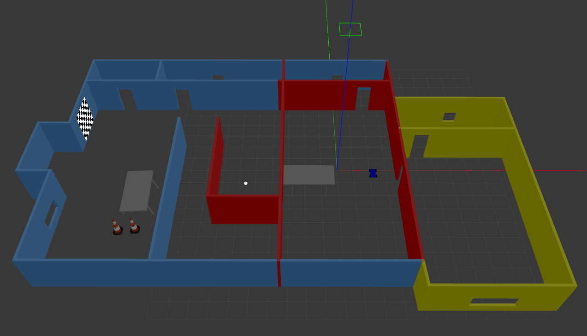

#### Chase It Around Q802



#### Overview 
Dropping this project into your `catkin_ws/src/` directory, it will create two 
ROS packages: the `drive_bot` and the `ball_chaser`.  Tthe robot, housed it 
inside your/a world, is programmed to chase white-colored balls:

#### ROS packages and architecture:

`drive_bot`:
- my_robot ROS package to holds the robot, a white ball, and the world.
- It is designed as a 4-wheeled skid-steer robot in the Unified Robot Description Format. 
- Two sensors are added robot: a lidar and a camera. Gazebo plugins are utilized for the
robot’s skid-steer drive, lidar, and camera functionality.
- The robot is housed inside a previously built world.
- A white-colored ball has been added to the world. 
- The world.launch file launches the world with the white-colored ball and the robot.

`ball_chaser`:
- a ball_chaser ROS package holds the C++ nodes.
- A `drive_bot` C++ node provides a ball_chaser/command_robot service to drive the 
robot by controlling its linear x and angular z velocities. The service publishes
to the wheel joints and return back the requested velocities.
- The `process_image` C++ node reads the robot’s camera image, analyzes it to determine
the presence and position of a white ball. If a white ball exists in the image, the node
requests makes a service request via a client to drive the robot towards it.
- The ball_chaser.launch runs both the `drive_bot` and the `process_image` nodes.

#### ROS 1 Setup

The usual
```
# if required
$ mkdir -p <some-path-of-your-choice>/catkin_ws/src
$ cd <some-path-of-your-choice>/catkin_ws/src
$ catkin_init_workspace
```

#### Run

Launch the robot witin the world
```
$ cd /home/workspace/catkin_ws/
$ source devel/setup.bash
$ roslaunch my_robot world.launch
```

Run `drive_bot` and `process_image`
```
$ cd /home/workspace/catkin_ws/
$ source devel/setup.bash
$ roslaunch ball_chaser ball_chaser.launch
```

Visualize the robot’s camera images, via subscribing to camera RGB image topic from RViz. 
Or run the rqt_image_view node: 
```
$ cd /home/workspace/catkin_ws/
$ source devel/setup.bash
$ rosrun rqt_image_view rqt_image_view  
```

#### Future Work/Feedback

- [C++ class for ROS Nodes](https://github.com/wsnewman/ros_class/tree/master/example_ros_class)
- [cv_bridge usage](http://wiki.ros.org/cv_bridge/Tutorials/UsingCvBridgeToConvertBetweenROSImagesAndOpenCVImages)
- [OpenCV for ball detection-pyimagesearch](https://www.pyimagesearch.com/2015/09/14/ball-tracking-with-opencv/)
- [OpenCV for ball detection](http://profs.scienze.univr.it/~bloisi/tutorial/balldetection.html)
